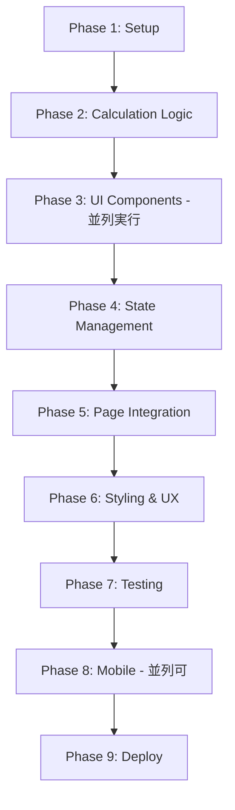

# 開発計画書 - Development Plan

## 開発戦略

### MCPサーバー要件分析

このプロジェクトでは、**追加のMCPサーバーは不要**と判断します。

**理由**:
- ✅ フロントエンドのみの構成（バックエンド不要）
- ✅ 外部API連携なし
- ✅ データベース不要（localStorage使用）
- ✅ 既存のClaude Code標準機能で十分対応可能

**利用する既存ツール**:
- ファイル操作: Read, Write, Edit, Glob
- 開発サーバー: Bash (npm run dev)
- テスト実行: Bash (npm run test)

---

## サブエージェント活用戦略

### 推奨アプローチ

**サブエージェント（Task tool）を使用すべき場面**:

1. **Phase 1 - プロジェクトセットアップ**
   - 使用: ❌ 不要（シンプルなコマンド実行のみ）
   - 理由: Viteプロジェクト作成は標準的な手順

2. **Phase 2 - ローン計算ロジック実装**
   - 使用: ✅ **推奨**
   - 理由: 複雑な金融計算式の実装とテスト作成
   - Agent type: `general-purpose`

3. **Phase 3 - コンポーネント開発**
   - 使用: ✅ **推奨**（並列実行）
   - 理由: 独立した複数コンポーネントを同時開発
   - 複数のサブエージェントを並列起動

4. **Phase 4 - 統合とテスト**
   - 使用: ❌ 不要
   - 理由: メインエージェントで統合作業

5. **Phase 5 - モバイル対応**
   - 使用: ⚠️ 必要に応じて
   - 理由: Capacitor設定は比較的単純

### サブエージェント実行例

```bash
# 例: 3つのコンポーネントを並列開発
# 1つのメッセージで複数のTask toolを呼び出す

Task 1: Calculator/Keypadコンポーネント実装
Task 2: Input/LoanFormコンポーネント実装
Task 3: Result/Summaryコンポーネント実装
```

---

## 開発チケット一覧

### Phase 1: プロジェクトセットアップ (1日)

#### TICKET-001: Viteプロジェクト初期化
- **優先度**: 🔴 最高
- **見積**: 30分
- **依存**: なし
- **担当**: メインエージェント

**タスク**:
- [ ] `npm create vite@latest` でプロジェクト作成
- [ ] TypeScript + React テンプレート選択
- [ ] `npm install` で依存パッケージインストール
- [ ] `npm run dev` で起動確認

**成果物**:
- `package.json`
- `vite.config.ts`
- `tsconfig.json`
- 基本的なReactアプリが起動すること

---

#### TICKET-002: Tailwind CSS セットアップ
- **優先度**: 🔴 最高
- **見積**: 30分
- **依存**: TICKET-001
- **担当**: メインエージェント

**タスク**:
- [ ] `npm install -D tailwindcss postcss autoprefixer`
- [ ] `npx tailwindcss init -p` で設定ファイル作成
- [ ] `tailwind.config.js` のカスタマイズ（カラー、スペーシング）
- [ ] `src/index.css` にTailwindディレクティブ追加
- [ ] 動作確認用のテストスタイル適用

**成果物**:
- `tailwind.config.js`
- `postcss.config.js`
- 更新された `src/index.css`

**Tailwind設定内容**:
```javascript
module.exports = {
  content: ['./index.html', './src/**/*.{js,ts,jsx,tsx}'],
  theme: {
    extend: {
      colors: {
        primary: '#1E40AF',
        secondary: '#10B981',
        accent: '#F59E0B',
      },
      spacing: {
        'calculator': '4.5rem',
      }
    },
  },
}
```

---

#### TICKET-003: ディレクトリ構造作成
- **優先度**: 🔴 最高
- **見積**: 15分
- **依存**: TICKET-001
- **担当**: メインエージェント

**タスク**:
- [ ] `src/components/` ディレクトリ作成
- [ ] `src/contexts/` ディレクトリ作成
- [ ] `src/hooks/` ディレクトリ作成
- [ ] `src/utils/` ディレクトリ作成
- [ ] `src/types/` ディレクトリ作成
- [ ] `src/pages/` ディレクトリ作成
- [ ] `tests/unit/` ディレクトリ作成

**成果物**:
- 標準的なディレクトリ構造

---

#### TICKET-004: TypeScript型定義
- **優先度**: 🔴 最高
- **見積**: 30分
- **依存**: TICKET-003
- **担当**: メインエージェント

**タスク**:
- [ ] `src/types/loan.ts` 作成
- [ ] `LoanParams` インターフェース定義
- [ ] `LoanResult` インターフェース定義
- [ ] `PaymentSchedule` インターフェース定義
- [ ] `LoanHistory` インターフェース定義
- [ ] エクスポート設定

**成果物**:
- `src/types/loan.ts`

---

### Phase 2: ローン計算ロジック (2-3日)

#### TICKET-101: 計算ユーティリティ基盤
- **優先度**: 🔴 最高
- **見積**: 1時間
- **依存**: TICKET-004
- **担当**: 🤖 **サブエージェント推奨** (general-purpose)

**タスク**:
- [ ] `src/utils/loanCalculator.ts` 作成
- [ ] 月次金利計算ヘルパー関数
- [ ] 入力バリデーション関数
- [ ] 数値フォーマット関数（カンマ区切り等）
- [ ] 丸め処理の共通関数

**成果物**:
- `src/utils/loanCalculator.ts`（基盤部分）

---

#### TICKET-102: 元利均等返済計算実装
- **優先度**: 🔴 最高
- **見積**: 2時間
- **依存**: TICKET-101
- **担当**: 🤖 **サブエージェント推奨**

**タスク**:
- [ ] `calculateEqualPayment()` 関数実装
- [ ] PMT計算式の実装
- [ ] 金利0%のエッジケース対応
- [ ] 単体テスト作成（最低5ケース）
- [ ] 実際の金融電卓との比較検証

**計算式**:
```
PMT = P * (r * (1 + r)^n) / ((1 + r)^n - 1)
```

**テストケース例**:
- 3000万円、35年、1.5% → 月々91,855円
- 2000万円、20年、0.5% → 月々87,925円
- 5000万円、35年、2.0% → 月々165,631円

**成果物**:
- `calculateEqualPayment()` 関数
- `tests/unit/loanCalculator.test.ts`（元利均等部分）

---

#### TICKET-103: 元金均等返済計算実装
- **優先度**: 🔴 最高
- **見積**: 2時間
- **依存**: TICKET-101
- **担当**: 🤖 **サブエージェント推奨**

**タスク**:
- [ ] `calculateEqualPrincipal()` 関数実装
- [ ] 返済計画表（PaymentSchedule[]）生成
- [ ] 月ごとの元金・利息・残高計算
- [ ] 単体テスト作成（最低5ケース）
- [ ] 元利均等との比較テスト

**成果物**:
- `calculateEqualPrincipal()` 関数
- テストケース追加

---

#### TICKET-104: ボーナス払い計算実装
- **優先度**: 🟡 高
- **見積**: 3時間
- **依存**: TICKET-102, TICKET-103
- **担当**: 🤖 **サブエージェント推奨**

**タスク**:
- [ ] `calculateWithBonus()` 関数実装
- [ ] ボーナス月の判定ロジック
- [ ] 月次返済とボーナス返済の分離計算
- [ ] 年2回のボーナス月対応
- [ ] 単体テスト作成（複雑なケース含む）

**成果物**:
- `calculateWithBonus()` 関数
- ボーナス払いテストケース

---

#### TICKET-105: 返済計画表生成
- **優先度**: 🟡 高
- **見積**: 2時間
- **依存**: TICKET-102, TICKET-103
- **担当**: メインエージェント

**タスク**:
- [ ] `generatePaymentSchedule()` 関数実装
- [ ] 月次データの集計
- [ ] 累計利息・累計元金計算
- [ ] CSVエクスポート機能（オプション）

**成果物**:
- 返済計画表生成関数

---

### Phase 3: UIコンポーネント開発 (4-5日)

#### TICKET-201: Layout コンポーネント
- **優先度**: 🔴 最高
- **見積**: 1時間
- **依存**: TICKET-002
- **担当**: メインエージェント

**タスク**:
- [ ] `src/components/Layout/Container.tsx`
- [ ] `src/components/Layout/Header.tsx`
- [ ] `src/components/Layout/Footer.tsx`
- [ ] レスポンシブ対応
- [ ] 基本的なスタイリング

**成果物**:
- 3つのLayoutコンポーネント

---

#### TICKET-202: Calculator/Keypad コンポーネント
- **優先度**: 🔴 最高
- **見積**: 3時間
- **依存**: TICKET-002
- **担当**: 🤖 **サブエージェント推奨** (並列実行1)

**タスク**:
- [ ] `src/components/Calculator/Keypad.tsx` 作成
- [ ] 0-9の数字ボタン
- [ ] 小数点（.）ボタン
- [ ] クリア（C）ボタン
- [ ] バックスペース（←）ボタン
- [ ] グリッドレイアウト（3x4）
- [ ] タップフィードバック（activeクラス）
- [ ] コンポーネントテスト

**デザイン要件**:
- ボタンサイズ: 最小44x44px（モバイル）
- グリーン系カラーで統一
- ホバー/アクティブ状態のスタイル

**成果物**:
- `Keypad.tsx`
- `tests/unit/Keypad.test.tsx`

---

#### TICKET-203: Calculator/Display コンポーネント
- **優先度**: 🔴 最高
- **見積**: 2時間
- **依存**: TICKET-002
- **担当**: 🤖 **サブエージェント推奨** (並列実行2)

**タスク**:
- [ ] `src/components/Calculator/Display.tsx` 作成
- [ ] 数値表示エリア
- [ ] カンマ区切りフォーマット
- [ ] 大きな数字用フォント
- [ ] 入力値のリアルタイム表示
- [ ] コンポーネントテスト

**成果物**:
- `Display.tsx`
- テスト

---

#### TICKET-204: Input/LoanForm コンポーネント
- **優先度**: 🔴 最高
- **見積**: 3時間
- **依存**: TICKET-004
- **担当**: 🤖 **サブエージェント推奨** (並列実行3)

**タスク**:
- [ ] `src/components/Input/LoanForm.tsx` 作成
- [ ] 借入金額入力フィールド
- [ ] 返済期間（年・月）入力
- [ ] 金利入力フィールド
- [ ] 返済方式ラジオボタン（元利均等/元金均等）
- [ ] バリデーション実装
- [ ] エラーメッセージ表示

**バリデーション**:
- 借入金額: 1円 〜 10億円
- 返済期間: 1ヶ月 〜 50年
- 金利: 0% 〜 20%

**成果物**:
- `LoanForm.tsx`
- `tests/unit/LoanForm.test.tsx`

---

#### TICKET-205: Input/BonusSettings コンポーネント
- **優先度**: 🟡 高
- **見積**: 2時間
- **依存**: TICKET-204
- **担当**: メインエージェント

**タスク**:
- [ ] `src/components/Input/BonusSettings.tsx` 作成
- [ ] ボーナス払いチェックボックス
- [ ] ボーナス金額入力
- [ ] ボーナス月選択（年2回）
- [ ] 条件付き表示制御

**成果物**:
- `BonusSettings.tsx`

---

#### TICKET-206: Result/Summary コンポーネント
- **優先度**: 🔴 最高
- **見積**: 2時間
- **依存**: TICKET-004
- **担当**: 🤖 **サブエージェント推奨** (並列実行4)

**タスク**:
- [ ] `src/components/Result/Summary.tsx` 作成
- [ ] 月々返済額表示
- [ ] 総返済額表示
- [ ] 利息総額表示
- [ ] 数値フォーマット（カンマ、円マーク）
- [ ] カード風デザイン

**成果物**:
- `Summary.tsx`

---

#### TICKET-207: Result/Schedule コンポーネント
- **優先度**: 🟡 高
- **見積**: 3時間
- **依存**: TICKET-004
- **担当**: メインエージェント

**タスク**:
- [ ] `src/components/Result/Schedule.tsx` 作成
- [ ] 返済計画表（テーブル形式）
- [ ] 月、返済額、元金、利息、残高の列
- [ ] ページネーション（長期ローン対応）
- [ ] スクロール可能なテーブル

**成果物**:
- `Schedule.tsx`

---

#### TICKET-208: Result/Chart コンポーネント (オプション)
- **優先度**: 🟢 中
- **見積**: 3時間
- **依存**: TICKET-004
- **担当**: 後回し可

**タスク**:
- [ ] グラフライブラリ選定（Recharts推奨）
- [ ] 元金・利息の推移グラフ
- [ ] レスポンシブ対応

**成果物**:
- `Chart.tsx`

---

#### TICKET-209: History/HistoryList コンポーネント
- **優先度**: 🟡 高
- **見積**: 2時間
- **依存**: TICKET-004
- **担当**: メインエージェント

**タスク**:
- [ ] `src/components/History/HistoryList.tsx` 作成
- [ ] 履歴一覧表示
- [ ] 各項目に日時・金額表示
- [ ] クリックで再読み込み
- [ ] 削除ボタン

**成果物**:
- `HistoryList.tsx`
- `HistoryItem.tsx`

---

### Phase 4: 状態管理とロジック統合 (2-3日)

#### TICKET-301: LoanContext 実装
- **優先度**: 🔴 最高
- **見積**: 2時間
- **依存**: TICKET-004, TICKET-105
- **担当**: メインエージェント

**タスク**:
- [ ] `src/contexts/LoanContext.tsx` 作成
- [ ] Context作成（LoanContextType）
- [ ] Provider実装
- [ ] useState/useReducerで状態管理
- [ ] 計算実行関数
- [ ] 履歴管理関数

**管理する状態**:
- `loanParams`: ローンパラメータ
- `loanResult`: 計算結果
- `history`: 計算履歴（最大20件）

**成果物**:
- `LoanContext.tsx`

---

#### TICKET-302: カスタムフック実装
- **優先度**: 🟡 高
- **見積**: 3時間
- **依存**: TICKET-301
- **担当**: メインエージェント

**タスク**:
- [ ] `src/hooks/useCalculator.ts` 作成
- [ ] `src/hooks/useHistory.ts` 作成
- [ ] `src/hooks/useKeyboard.ts` 作成
- [ ] ロジックとUIの分離
- [ ] 単体テスト

**成果物**:
- 3つのカスタムフック

---

#### TICKET-303: localStorage 統合
- **優先度**: 🟡 高
- **見積**: 1時間
- **依存**: TICKET-301
- **担当**: メインエージェント

**タスク**:
- [ ] `src/utils/storage.ts` 作成
- [ ] `saveHistory()` 関数
- [ ] `loadHistory()` 関数
- [ ] `clearHistory()` 関数
- [ ] FIFO（最大20件）実装
- [ ] エラーハンドリング

**成果物**:
- `storage.ts`

---

#### TICKET-304: キーボードショートカット
- **優先度**: 🟡 高
- **見積**: 2時間
- **依存**: TICKET-302
- **担当**: メインエージェント

**タスク**:
- [ ] 数字キー（0-9）対応
- [ ] テンキー対応
- [ ] Enterキー（計算実行）
- [ ] Escapeキー（クリア）
- [ ] Backspaceキー（削除）
- [ ] イベントリスナー設定

**成果物**:
- `useKeyboard.ts` の完全実装

---

### Phase 5: ページ統合とルーティング (1-2日)

#### TICKET-401: Home ページ
- **優先度**: 🔴 最高
- **見積**: 2時間
- **依存**: TICKET-202-209
- **担当**: メインエージェント

**タスク**:
- [ ] `src/pages/Home.tsx` 作成
- [ ] LoanFormとCalculatorの配置
- [ ] Resultの配置
- [ ] レスポンシブレイアウト
- [ ] 統合テスト

**成果物**:
- `Home.tsx`

---

#### TICKET-402: History ページ
- **優先度**: 🟡 高
- **見積**: 1時間
- **依存**: TICKET-209
- **担当**: メインエージェント

**タスク**:
- [ ] `src/pages/History.tsx` 作成
- [ ] HistoryListの統合
- [ ] 空状態の表示

**成果物**:
- `History.tsx`

---

#### TICKET-403: ルーティング設定
- **優先度**: 🟡 高
- **見積**: 1時間
- **依存**: TICKET-401, TICKET-402
- **担当**: メインエージェント

**タスク**:
- [ ] React Router インストール
- [ ] `src/App.tsx` でルーティング設定
- [ ] ナビゲーション実装
- [ ] 404ページ

**成果物**:
- 更新された `App.tsx`

---

### Phase 6: スタイリングとUX改善 (2-3日)

#### TICKET-501: レスポンシブデザイン調整
- **優先度**: 🔴 最高
- **見積**: 3時間
- **依存**: TICKET-401
- **担当**: メインエージェント

**タスク**:
- [ ] モバイル表示の最適化
- [ ] タブレット表示の最適化
- [ ] デスクトップ表示の最適化
- [ ] ブレイクポイントの調整

**テストデバイス**:
- iPhone SE (375px)
- iPad (768px)
- Desktop (1024px+)

---

#### TICKET-502: アニメーションとトランジション
- **優先度**: 🟢 中
- **見積**: 2時間
- **依存**: TICKET-501
- **担当**: メインエージェント

**タスク**:
- [ ] ボタンタップのフィードバック
- [ ] 画面遷移アニメーション
- [ ] 計算結果の表示アニメーション
- [ ] ローディング状態

---

#### TICKET-503: エラーハンドリング
- **優先度**: 🔴 最高
- **見積**: 2時間
- **依存**: TICKET-401
- **担当**: メインエージェント

**タスク**:
- [ ] バリデーションエラー表示
- [ ] 計算エラーのハンドリング
- [ ] localStorage エラー対応
- [ ] フォールバック UI

---

### Phase 7: テストとQA (2-3日)

#### TICKET-601: 単体テスト完成
- **優先度**: 🔴 最高
- **見積**: 3時間
- **依存**: すべてのコンポーネント
- **担当**: メインエージェント

**タスク**:
- [ ] すべてのユーティリティ関数のテスト
- [ ] カバレッジ80%以上
- [ ] エッジケーステスト

---

#### TICKET-602: 統合テスト
- **優先度**: 🟡 高
- **見積**: 3時間
- **依存**: TICKET-401
- **担当**: メインエージェント

**タスク**:
- [ ] 計算フロー全体のテスト
- [ ] 履歴保存・読込のテスト
- [ ] キーボード操作のテスト

---

#### TICKET-603: クロスブラウザテスト
- **優先度**: 🟡 高
- **見積**: 2時間
- **依存**: TICKET-501
- **担当**: メインエージェント

**タスク**:
- [ ] Chrome (最新版)
- [ ] Firefox (最新版)
- [ ] Safari (iOS/macOS)
- [ ] Edge (最新版)

---

### Phase 8: モバイルアプリ化 (2-3日)

#### TICKET-701: Capacitor セットアップ
- **優先度**: 🟡 高
- **見積**: 1時間
- **依存**: TICKET-603
- **担当**: メインエージェント

**タスク**:
- [ ] `@capacitor/core` インストール
- [ ] `@capacitor/cli` インストール
- [ ] `npx cap init` 実行
- [ ] `capacitor.config.json` 設定

---

#### TICKET-702: Android ビルド
- **優先度**: 🟡 高
- **見積**: 2時間
- **依存**: TICKET-701
- **担当**: メインエージェント

**タスク**:
- [ ] `npx cap add android`
- [ ] Android Studio で開く
- [ ] アイコン・スプラッシュ設定
- [ ] ビルドテスト

---

#### TICKET-703: iOS ビルド
- **優先度**: 🟡 高
- **見積**: 2時間
- **依存**: TICKET-701
- **担当**: メインエージェント（Mac必須）

**タスク**:
- [ ] `npx cap add ios`
- [ ] Xcode で開く
- [ ] アイコン・スプラッシュ設定
- [ ] シミュレータテスト

---

### Phase 9: デプロイとリリース (1-2日)

#### TICKET-801: プロダクションビルド最適化
- **優先度**: 🔴 最高
- **見積**: 2時間
- **依存**: TICKET-603
- **担当**: メインエージェント

**タスク**:
- [ ] `vite.config.ts` 最適化
- [ ] コード分割設定
- [ ] 画像最適化
- [ ] バンドルサイズ確認

---

#### TICKET-802: Vercel デプロイ
- **優先度**: 🔴 最高
- **見積**: 30分
- **依存**: TICKET-801
- **担当**: メインエージェント

**タスク**:
- [ ] Vercelアカウント作成
- [ ] プロジェクト接続
- [ ] 環境変数設定（必要であれば）
- [ ] デプロイ実行
- [ ] カスタムドメイン設定（オプション）

---

#### TICKET-803: ドキュメント整備
- **優先度**: 🟡 高
- **見積**: 1時間
- **依存**: TICKET-802
- **担当**: メインエージェント

**タスク**:
- [ ] README.md 作成
- [ ] デプロイ手順書
- [ ] トラブルシューティング
- [ ] ライセンス設定

---

## 開発ワークフロー

### 推奨実行順序



### サブエージェント並列実行プラン

**Phase 3での並列実行例**:

```
同時に4つのサブエージェントを起動:
├─ Agent 1: TICKET-202 (Keypad)
├─ Agent 2: TICKET-203 (Display)
├─ Agent 3: TICKET-204 (LoanForm)
└─ Agent 4: TICKET-206 (Summary)

メインエージェント: レイアウトコンポーネント作成
```

**利点**:
- 開発時間を約50%短縮
- 独立したコンポーネントを並行開発
- 統合時の競合を最小化

---

## 進捗管理

### チケットステータス

- 🔴 **最高優先度**: 必須機能、ブロッカー
- 🟡 **高優先度**: 重要だが後回し可能
- 🟢 **中優先度**: あると良い機能
- ⚪ **低優先度**: 将来的な拡張

### チェックリスト

各チケット完了時に確認:
- [ ] コードが動作すること
- [ ] TypeScript型エラーなし
- [ ] テストが通ること（該当する場合）
- [ ] レスポンシブ対応（UIコンポーネント）
- [ ] コードレビュー（重要なロジック）

---

## 見積もり合計

| Phase | 見積時間 | 期間 |
|-------|---------|------|
| Phase 1 | 2時間 | 0.5日 |
| Phase 2 | 10時間 | 2日 |
| Phase 3 | 18時間 | 3日（並列実行で2日） |
| Phase 4 | 8時間 | 1.5日 |
| Phase 5 | 4時間 | 0.5日 |
| Phase 6 | 7時間 | 1日 |
| Phase 7 | 8時間 | 1.5日 |
| Phase 8 | 5時間 | 1日 |
| Phase 9 | 3.5時間 | 0.5日 |
| **合計** | **65.5時間** | **12-14日** |

**並列実行を活用した場合: 10-12日**

---

## 次のアクション

1. ✅ このドキュメントを確認
2. ⬜ TICKET-001から順次実行開始
3. ⬜ Phase 2でサブエージェント活用
4. ⬜ Phase 3で並列開発実施
5. ⬜ 各Phaseごとに進捗確認

---

**作成日**: 2025-10-12
**最終更新**: 2025-10-12
**ステータス**: レビュー待ち
