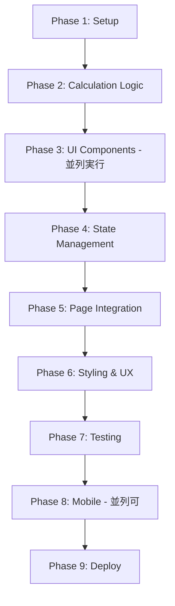

# 開発計画書 - Development Plan

## 開発戦略

### MCPサーバー要件分析

このプロジェクトでは、**追加のMCPサーバーは不要**と判断します。

**理由**:
- ✅ フロントエンドのみの構成（バックエンド不要）
- ✅ 外部API連携なし
- ✅ データベース不要（localStorage使用）
- ✅ 既存のClaude Code標準機能で十分対応可能

**利用する既存ツール**:
- ファイル操作: Read, Write, Edit, Glob
- 開発サーバー: Bash (npm run dev)
- テスト実行: Bash (npm run test)

---

## サブエージェント活用戦略

### 推奨アプローチ

**サブエージェント（Task tool）を使用すべき場面**:

1. **Phase 1 - プロジェクトセットアップ**
   - 使用: ❌ 不要（シンプルなコマンド実行のみ）
   - 理由: Viteプロジェクト作成は標準的な手順

2. **Phase 2 - ローン計算ロジック実装**
   - 使用: ✅ **推奨**
   - 理由: 複雑な金融計算式の実装とテスト作成
   - Agent type: `general-purpose`

3. **Phase 3 - コンポーネント開発**
   - 使用: ✅ **推奨**（並列実行）
   - 理由: 独立した複数コンポーネントを同時開発
   - 複数のサブエージェントを並列起動

4. **Phase 4 - 統合とテスト**
   - 使用: ❌ 不要
   - 理由: メインエージェントで統合作業

5. **Phase 5 - モバイル対応**
   - 使用: ⚠️ 必要に応じて
   - 理由: Capacitor設定は比較的単純

### サブエージェント実行例

```bash
# 例: 3つのコンポーネントを並列開発
# 1つのメッセージで複数のTask toolを呼び出す

Task 1: Calculator/Keypadコンポーネント実装
Task 2: Input/LoanFormコンポーネント実装
Task 3: Result/Summaryコンポーネント実装
```

---

## 開発チケット一覧

### Phase 1: プロジェクトセットアップ (1日)

#### TICKET-001: Viteプロジェクト初期化
- **優先度**: 🔴 最高
- **見積**: 30分
- **依存**: なし
- **担当**: メインエージェント

**タスク**:
- [ ] `npm create vite@latest` でプロジェクト作成
- [ ] TypeScript + React テンプレート選択
- [ ] `npm install` で依存パッケージインストール
- [ ] `npm run dev` で起動確認

**成果物**:
- `package.json`
- `vite.config.ts`
- `tsconfig.json`
- 基本的なReactアプリが起動すること

---

#### TICKET-002: Tailwind CSS セットアップ
- **優先度**: 🔴 最高
- **見積**: 30分
- **依存**: TICKET-001
- **担当**: メインエージェント

**タスク**:
- [ ] `npm install -D tailwindcss postcss autoprefixer`
- [ ] `npx tailwindcss init -p` で設定ファイル作成
- [ ] `tailwind.config.js` のカスタマイズ（カラー、スペーシング）
- [ ] `src/index.css` にTailwindディレクティブ追加
- [ ] 動作確認用のテストスタイル適用

**成果物**:
- `tailwind.config.js`
- `postcss.config.js`
- 更新された `src/index.css`

**Tailwind設定内容**:
```javascript
module.exports = {
  content: ['./index.html', './src/**/*.{js,ts,jsx,tsx}'],
  theme: {
    extend: {
      colors: {
        primary: '#1E40AF',
        secondary: '#10B981',
        accent: '#F59E0B',
      },
      spacing: {
        'calculator': '4.5rem',
      }
    },
  },
}
```

---

#### TICKET-003: ディレクトリ構造作成
- **優先度**: 🔴 最高
- **見積**: 15分
- **依存**: TICKET-001
- **担当**: メインエージェント

**タスク**:
- [ ] `src/components/` ディレクトリ作成
- [ ] `src/contexts/` ディレクトリ作成
- [ ] `src/hooks/` ディレクトリ作成
- [ ] `src/utils/` ディレクトリ作成
- [ ] `src/types/` ディレクトリ作成
- [ ] `src/pages/` ディレクトリ作成
- [ ] `tests/unit/` ディレクトリ作成

**成果物**:
- 標準的なディレクトリ構造

---

#### TICKET-004: TypeScript型定義
- **優先度**: 🔴 最高
- **見積**: 30分
- **依存**: TICKET-003
- **担当**: メインエージェント

**タスク**:
- [ ] `src/types/loan.ts` 作成
- [ ] `LoanParams` インターフェース定義
- [ ] `LoanResult` インターフェース定義
- [ ] `PaymentSchedule` インターフェース定義
- [ ] `LoanHistory` インターフェース定義
- [ ] エクスポート設定

**成果物**:
- `src/types/loan.ts`

---

### Phase 2: ローン計算ロジック (2-3日)

#### TICKET-101: 計算ユーティリティ基盤
- **優先度**: 🔴 最高
- **見積**: 1時間
- **依存**: TICKET-004
- **担当**: 🤖 **サブエージェント推奨** (general-purpose)

**タスク**:
- [ ] `src/utils/loanCalculator.ts` 作成
- [ ] 月次金利計算ヘルパー関数
- [ ] 入力バリデーション関数
- [ ] 数値フォーマット関数（カンマ区切り等）
- [ ] 丸め処理の共通関数

**成果物**:
- `src/utils/loanCalculator.ts`（基盤部分）

---

#### TICKET-102: 元利均等返済計算実装
- **優先度**: 🔴 最高
- **見積**: 2時間
- **依存**: TICKET-101
- **担当**: 🤖 **サブエージェント推奨**

**タスク**:
- [ ] `calculateEqualPayment()` 関数実装
- [ ] PMT計算式の実装
- [ ] 金利0%のエッジケース対応
- [ ] 単体テスト作成（最低5ケース）
- [ ] 実際の金融電卓との比較検証

**計算式**:
```
PMT = P * (r * (1 + r)^n) / ((1 + r)^n - 1)
```

**テストケース例**:
- 3000万円、35年、1.5% → 月々91,855円
- 2000万円、20年、0.5% → 月々87,925円
- 5000万円、35年、2.0% → 月々165,631円

**成果物**:
- `calculateEqualPayment()` 関数
- `tests/unit/loanCalculator.test.ts`（元利均等部分）

---

#### TICKET-103: 元金均等返済計算実装
- **優先度**: 🔴 最高
- **見積**: 2時間
- **依存**: TICKET-101
- **担当**: 🤖 **サブエージェント推奨**

**タスク**:
- [ ] `calculateEqualPrincipal()` 関数実装
- [ ] 返済計画表（PaymentSchedule[]）生成
- [ ] 月ごとの元金・利息・残高計算
- [ ] 単体テスト作成（最低5ケース）
- [ ] 元利均等との比較テスト

**成果物**:
- `calculateEqualPrincipal()` 関数
- テストケース追加

---

#### TICKET-104: ボーナス払い計算実装
- **優先度**: 🟡 高
- **見積**: 3時間
- **依存**: TICKET-102, TICKET-103
- **担当**: 🤖 **サブエージェント推奨**

**タスク**:
- [ ] `calculateWithBonus()` 関数実装
- [ ] ボーナス月の判定ロジック
- [ ] 月次返済とボーナス返済の分離計算
- [ ] 年2回のボーナス月対応
- [ ] 単体テスト作成（複雑なケース含む）

**成果物**:
- `calculateWithBonus()` 関数
- ボーナス払いテストケース

---

#### TICKET-105: 返済計画表生成
- **優先度**: 🟡 高
- **見積**: 2時間
- **依存**: TICKET-102, TICKET-103
- **担当**: メインエージェント

**タスク**:
- [ ] `generatePaymentSchedule()` 関数実装
- [ ] 月次データの集計
- [ ] 累計利息・累計元金計算
- [ ] CSVエクスポート機能（オプション）

**成果物**:
- 返済計画表生成関数

---

### Phase 3: UIコンポーネント開発 (4-5日)

#### TICKET-201: Layout コンポーネント
- **優先度**: 🔴 最高
- **見積**: 1時間
- **依存**: TICKET-002
- **担当**: メインエージェント

**タスク**:
- [ ] `src/components/Layout/Container.tsx`
- [ ] `src/components/Layout/Header.tsx`
- [ ] `src/components/Layout/Footer.tsx`
- [ ] レスポンシブ対応
- [ ] 基本的なスタイリング

**成果物**:
- 3つのLayoutコンポーネント

---

#### TICKET-202: Calculator/Keypad コンポーネント
- **優先度**: 🔴 最高
- **見積**: 3時間
- **依存**: TICKET-002
- **担当**: 🤖 **サブエージェント推奨** (並列実行1)

**タスク**:
- [ ] `src/components/Calculator/Keypad.tsx` 作成
- [ ] 0-9の数字ボタン
- [ ] 小数点（.）ボタン
- [ ] クリア（C）ボタン
- [ ] バックスペース（←）ボタン
- [ ] グリッドレイアウト（3x4）
- [ ] タップフィードバック（activeクラス）
- [ ] コンポーネントテスト

**デザイン要件**:
- ボタンサイズ: 最小44x44px（モバイル）
- グリーン系カラーで統一
- ホバー/アクティブ状態のスタイル

**成果物**:
- `Keypad.tsx`
- `tests/unit/Keypad.test.tsx`

---

#### TICKET-203: Calculator/Display コンポーネント
- **優先度**: 🔴 最高
- **見積**: 2時間
- **依存**: TICKET-002
- **担当**: 🤖 **サブエージェント推奨** (並列実行2)

**タスク**:
- [ ] `src/components/Calculator/Display.tsx` 作成
- [ ] 数値表示エリア
- [ ] カンマ区切りフォーマット
- [ ] 大きな数字用フォント
- [ ] 入力値のリアルタイム表示
- [ ] コンポーネントテスト

**成果物**:
- `Display.tsx`
- テスト

---

#### TICKET-204: Input/LoanForm コンポーネント
- **優先度**: 🔴 最高
- **見積**: 3時間
- **依存**: TICKET-004
- **担当**: 🤖 **サブエージェント推奨** (並列実行3)

**タスク**:
- [ ] `src/components/Input/LoanForm.tsx` 作成
- [ ] 借入金額入力フィールド
- [ ] 返済期間（年・月）入力
- [ ] 金利入力フィールド
- [ ] 返済方式ラジオボタン（元利均等/元金均等）
- [ ] バリデーション実装
- [ ] エラーメッセージ表示

**バリデーション**:
- 借入金額: 1円 〜 10億円
- 返済期間: 1ヶ月 〜 50年
- 金利: 0% 〜 20%

**成果物**:
- `LoanForm.tsx`
- `tests/unit/LoanForm.test.tsx`

---

#### TICKET-205: Input/BonusSettings コンポーネント
- **優先度**: 🟡 高
- **見積**: 2時間
- **依存**: TICKET-204
- **担当**: メインエージェント

**タスク**:
- [ ] `src/components/Input/BonusSettings.tsx` 作成
- [ ] ボーナス払いチェックボックス
- [ ] ボーナス金額入力
- [ ] ボーナス月選択（年2回）
- [ ] 条件付き表示制御

**成果物**:
- `BonusSettings.tsx`

---

#### TICKET-206: Result/Summary コンポーネント
- **優先度**: 🔴 最高
- **見積**: 2時間
- **依存**: TICKET-004
- **担当**: 🤖 **サブエージェント推奨** (並列実行4)

**タスク**:
- [ ] `src/components/Result/Summary.tsx` 作成
- [ ] 月々返済額表示
- [ ] 総返済額表示
- [ ] 利息総額表示
- [ ] 数値フォーマット（カンマ、円マーク）
- [ ] カード風デザイン

**成果物**:
- `Summary.tsx`

---

#### TICKET-207: Result/Schedule コンポーネント
- **優先度**: 🟡 高
- **見積**: 3時間
- **依存**: TICKET-004
- **担当**: メインエージェント

**タスク**:
- [ ] `src/components/Result/Schedule.tsx` 作成
- [ ] 返済計画表（テーブル形式）
- [ ] 月、返済額、元金、利息、残高の列
- [ ] ページネーション（長期ローン対応）
- [ ] スクロール可能なテーブル

**成果物**:
- `Schedule.tsx`

---

#### TICKET-208: Result/Chart コンポーネント (オプション)
- **優先度**: 🟢 中
- **見積**: 3時間
- **依存**: TICKET-004
- **担当**: 後回し可

**タスク**:
- [ ] グラフライブラリ選定（Recharts推奨）
- [ ] 元金・利息の推移グラフ
- [ ] レスポンシブ対応

**成果物**:
- `Chart.tsx`

---

#### TICKET-209: History/HistoryList コンポーネント
- **優先度**: 🟡 高
- **見積**: 2時間
- **依存**: TICKET-004
- **担当**: メインエージェント

**タスク**:
- [ ] `src/components/History/HistoryList.tsx` 作成
- [ ] 履歴一覧表示
- [ ] 各項目に日時・金額表示
- [ ] クリックで再読み込み
- [ ] 削除ボタン

**成果物**:
- `HistoryList.tsx`
- `HistoryItem.tsx`

---

### Phase 4: 状態管理とロジック統合 (2-3日)

#### TICKET-301: LoanContext 実装
- **優先度**: 🔴 最高
- **見積**: 2時間
- **依存**: TICKET-004, TICKET-105
- **担当**: メインエージェント

**タスク**:
- [ ] `src/contexts/LoanContext.tsx` 作成
- [ ] Context作成（LoanContextType）
- [ ] Provider実装
- [ ] useState/useReducerで状態管理
- [ ] 計算実行関数
- [ ] 履歴管理関数

**管理する状態**:
- `loanParams`: ローンパラメータ
- `loanResult`: 計算結果
- `history`: 計算履歴（最大20件）

**成果物**:
- `LoanContext.tsx`

---

#### TICKET-302: カスタムフック実装
- **優先度**: 🟡 高
- **見積**: 3時間
- **依存**: TICKET-301
- **担当**: メインエージェント

**タスク**:
- [ ] `src/hooks/useCalculator.ts` 作成
- [ ] `src/hooks/useHistory.ts` 作成
- [ ] `src/hooks/useKeyboard.ts` 作成
- [ ] ロジックとUIの分離
- [ ] 単体テスト

**成果物**:
- 3つのカスタムフック

---

#### TICKET-303: localStorage 統合
- **優先度**: 🟡 高
- **見積**: 1時間
- **依存**: TICKET-301
- **担当**: メインエージェント

**タスク**:
- [ ] `src/utils/storage.ts` 作成
- [ ] `saveHistory()` 関数
- [ ] `loadHistory()` 関数
- [ ] `clearHistory()` 関数
- [ ] FIFO（最大20件）実装
- [ ] エラーハンドリング

**成果物**:
- `storage.ts`

---

#### TICKET-304: キーボードショートカット
- **優先度**: 🟡 高
- **見積**: 2時間
- **依存**: TICKET-302
- **担当**: メインエージェント

**タスク**:
- [ ] 数字キー（0-9）対応
- [ ] テンキー対応
- [ ] Enterキー（計算実行）
- [ ] Escapeキー（クリア）
- [ ] Backspaceキー（削除）
- [ ] イベントリスナー設定

**成果物**:
- `useKeyboard.ts` の完全実装

---

### Phase 5: ページ統合とルーティング (1-2日)

#### TICKET-401: Home ページ
- **優先度**: 🔴 最高
- **見積**: 2時間
- **依存**: TICKET-202-209
- **担当**: メインエージェント

**タスク**:
- [ ] `src/pages/Home.tsx` 作成
- [ ] LoanFormとCalculatorの配置
- [ ] Resultの配置
- [ ] レスポンシブレイアウト
- [ ] 統合テスト

**成果物**:
- `Home.tsx`

---

#### TICKET-402: History ページ
- **優先度**: 🟡 高
- **見積**: 1時間
- **依存**: TICKET-209
- **担当**: メインエージェント

**タスク**:
- [ ] `src/pages/History.tsx` 作成
- [ ] HistoryListの統合
- [ ] 空状態の表示

**成果物**:
- `History.tsx`

---

#### TICKET-403: ルーティング設定
- **優先度**: 🟡 高
- **見積**: 1時間
- **依存**: TICKET-401, TICKET-402
- **担当**: メインエージェント

**タスク**:
- [ ] React Router インストール
- [ ] `src/App.tsx` でルーティング設定
- [ ] ナビゲーション実装
- [ ] 404ページ

**成果物**:
- 更新された `App.tsx`

---

### Phase 6: スタイリングとUX改善 (2-3日)

#### TICKET-501: レスポンシブデザイン調整
- **優先度**: 🔴 最高
- **見積**: 3時間
- **依存**: TICKET-401
- **担当**: メインエージェント

**タスク**:
- [ ] モバイル表示の最適化
- [ ] タブレット表示の最適化
- [ ] デスクトップ表示の最適化
- [ ] ブレイクポイントの調整

**テストデバイス**:
- iPhone SE (375px)
- iPad (768px)
- Desktop (1024px+)

---

#### TICKET-502: アニメーションとトランジション
- **優先度**: 🟢 中
- **見積**: 2時間
- **依存**: TICKET-501
- **担当**: メインエージェント

**タスク**:
- [ ] ボタンタップのフィードバック
- [ ] 画面遷移アニメーション
- [ ] 計算結果の表示アニメーション
- [ ] ローディング状態

---

#### TICKET-503: エラーハンドリング
- **優先度**: 🔴 最高
- **見積**: 2時間
- **依存**: TICKET-401
- **担当**: メインエージェント

**タスク**:
- [ ] バリデーションエラー表示
- [ ] 計算エラーのハンドリング
- [ ] localStorage エラー対応
- [ ] フォールバック UI

---

### Phase 7: テストとQA (2-3日)

#### TICKET-601: 単体テスト完成
- **優先度**: 🔴 最高
- **見積**: 3時間
- **依存**: すべてのコンポーネント
- **担当**: メインエージェント

**タスク**:
- [ ] すべてのユーティリティ関数のテスト
- [ ] カバレッジ80%以上
- [ ] エッジケーステスト

---

#### TICKET-602: 統合テスト
- **優先度**: 🟡 高
- **見積**: 3時間
- **依存**: TICKET-401
- **担当**: メインエージェント

**タスク**:
- [ ] 計算フロー全体のテスト
- [ ] 履歴保存・読込のテスト
- [ ] キーボード操作のテスト

---

#### TICKET-603: クロスブラウザテスト
- **優先度**: 🟡 高
- **見積**: 2時間
- **依存**: TICKET-501
- **担当**: メインエージェント

**タスク**:
- [ ] Chrome (最新版)
- [ ] Firefox (最新版)
- [ ] Safari (iOS/macOS)
- [ ] Edge (最新版)

---

### Phase 8: モバイルアプリ化 (2-3日)

#### TICKET-701: Capacitor セットアップ
- **優先度**: 🟡 高
- **見積**: 1時間
- **依存**: TICKET-603
- **担当**: メインエージェント

**タスク**:
- [ ] `@capacitor/core` インストール
- [ ] `@capacitor/cli` インストール
- [ ] `npx cap init` 実行
- [ ] `capacitor.config.json` 設定

---

#### TICKET-702: Android ビルド
- **優先度**: 🟡 高
- **見積**: 2時間
- **依存**: TICKET-701
- **担当**: メインエージェント

**タスク**:
- [ ] `npx cap add android`
- [ ] Android Studio で開く
- [ ] アイコン・スプラッシュ設定
- [ ] ビルドテスト

---

#### TICKET-703: iOS ビルド
- **優先度**: 🟡 高
- **見積**: 2時間
- **依存**: TICKET-701
- **担当**: メインエージェント（Mac必須）

**タスク**:
- [ ] `npx cap add ios`
- [ ] Xcode で開く
- [ ] アイコン・スプラッシュ設定
- [ ] シミュレータテスト

---

### Phase 9: デプロイとリリース (1-2日)

#### TICKET-801: プロダクションビルド最適化
- **優先度**: 🔴 最高
- **見積**: 2時間
- **依存**: TICKET-603
- **担当**: メインエージェント

**タスク**:
- [ ] `vite.config.ts` 最適化
- [ ] コード分割設定
- [ ] 画像最適化
- [ ] バンドルサイズ確認

---

#### TICKET-802: Vercel デプロイ
- **優先度**: 🔴 最高
- **見積**: 30分
- **依存**: TICKET-801
- **担当**: メインエージェント

**タスク**:
- [ ] Vercelアカウント作成
- [ ] プロジェクト接続
- [ ] 環境変数設定（必要であれば）
- [ ] デプロイ実行
- [ ] カスタムドメイン設定（オプション）

---

#### TICKET-803: ドキュメント整備
- **優先度**: 🟡 高
- **見積**: 1時間
- **依存**: TICKET-802
- **担当**: メインエージェント

**タスク**:
- [ ] README.md 作成
- [ ] デプロイ手順書
- [ ] トラブルシューティング
- [ ] ライセンス設定

---

## 開発ワークフロー

### 推奨実行順序



### サブエージェント並列実行プラン

**Phase 3での並列実行例**:

```
同時に4つのサブエージェントを起動:
├─ Agent 1: TICKET-202 (Keypad)
├─ Agent 2: TICKET-203 (Display)
├─ Agent 3: TICKET-204 (LoanForm)
└─ Agent 4: TICKET-206 (Summary)

メインエージェント: レイアウトコンポーネント作成
```

**利点**:
- 開発時間を約50%短縮
- 独立したコンポーネントを並行開発
- 統合時の競合を最小化

---

## 進捗管理

### チケットステータス

- 🔴 **最高優先度**: 必須機能、ブロッカー
- 🟡 **高優先度**: 重要だが後回し可能
- 🟢 **中優先度**: あると良い機能
- ⚪ **低優先度**: 将来的な拡張

### チェックリスト

各チケット完了時に確認:
- [ ] コードが動作すること
- [ ] TypeScript型エラーなし
- [ ] テストが通ること（該当する場合）
- [ ] レスポンシブ対応（UIコンポーネント）
- [ ] コードレビュー（重要なロジック）

---

## 見積もり合計

| Phase | 見積時間 | 期間 |
|-------|---------|------|
| Phase 1 | 2時間 | 0.5日 |
| Phase 2 | 10時間 | 2日 |
| Phase 3 | 18時間 | 3日（並列実行で2日） |
| Phase 4 | 8時間 | 1.5日 |
| Phase 5 | 4時間 | 0.5日 |
| Phase 6 | 7時間 | 1日 |
| Phase 7 | 8時間 | 1.5日 |
| Phase 8 | 5時間 | 1日 |
| Phase 9 | 3.5時間 | 0.5日 |
| **合計** | **65.5時間** | **12-14日** |

**並列実行を活用した場合: 10-12日**

---

## 次のアクション

1. ✅ このドキュメントを確認
2. ✅ TICKET-001から順次実行開始
3. ✅ Phase 2でサブエージェント活用
4. ✅ Phase 3で並列開発実施
5. ⬜ Phase 4: 状態管理とロジック統合 (TICKET-301〜304)
6. ⬜ Phase 5: ページ統合とルーティング
7. ⬜ Phase 6: スタイリングとUX改善
8. ⬜ Phase 7-9: テスト・モバイル・デプロイ

---

**作成日**: 2025-10-12
**最終更新**: 2025-10-12
**ステータス**: Phase 3 完了 ✅ / Phase 4 実施中

---

## 追加実装記録 (2025-10-13)

### 逆算機能の実装

**実装日**: 2025-10-13

**目的**: 月々の返済額から借入可能額を計算する機能を追加

**実装内容**:

1. **新規型定義**:
   - `CalculationMode`: 'forward' | 'reverse'
   - `ReverseLoanParams`: 逆算用のパラメータ型
   - `ReverseBonusPayment`: 逆算用のボーナス払い型

2. **新規コンポーネント**:
   - `ReverseLoanForm.tsx`: 逆算用の入力フォーム
   - `ReverseBonusSettings.tsx`: 逆算用のボーナス設定

3. **Context更新**:
   - `LoanContext.calculateReverse()`: 逆算ロジック実装
   - ボーナス払い対応の逆算計算

4. **UI改善**:
   - Home.tsx にモード切り替えボタン追加
   - 「借入額から計算」「返済額から計算」の2モード

**重要な修正 (午後)**:

**問題**: ボーナス20万円入力が16万円で表示される

**原因**: 
```typescript
// 間違った計算（総返済額の割合で分割）
const bonusPaymentRatio = (bonusPayment * totalBonusPayments) / totalPaymentAmount;
calculatedBonusAmount = calculatedPrincipal * bonusPaymentRatio;
```

**解決策**:
```typescript
// 正しい計算（直接計算）
// Step 1: 月々13万円 → 通常分の借入可能額
const regularPrincipal = calculatePrincipalFromPayment(monthlyPayment, rate, 480);

// Step 2: ボーナス20万円 → ボーナス分の借入可能額
const bonusPrincipal = calculatePrincipalFromPayment(bonusPayment, rate, 80);

// Step 3: 合計
const totalPrincipal = regularPrincipal + bonusPrincipal;
```

**結果**:
- ✅ 入力20万円が正しく20万円として表示
- ✅ 逆算と順算が完全一致
- ✅ テスト全74件継続合格

**デフォルト値の更新**:
- 借入金額: 3000万円 → **4500万円**
- 金利: 1.5% → **1.0%**
- 返済期間: 35年 → **40年**
- ボーナス分借入: 0円 → **1000万円**
- 逆算モード月額: **13万円**
- 逆算モードボーナス: **20万円**

**コミット履歴**:
1. `a4d2cbb` - feat: Implement reverse calculation
2. `0d064fc` - feat: Add bonus payment support for reverse
3. `4a446bb` - fix: Improve increment step and fix reverse bonus
4. `bceeee3` - fix: Major corrections to UI and reverse bonus
5. `4a6e6f6` - feat: Improve bonus payment UX and fix reverse display
6. `6e9a4a2` - refactor: Remove help texts and update default values
7. `aa927b7` - fix: Update default values to 4500万円, 1% interest, 40 years
8. `4473e7f` - fix: Correct reverse bonus calculation logic

**テスト状況**: ✅ All 74 tests passing

---

## Phase 9.5: NISA複利計算ツール追加（無料版機能拡張）

### 概要

**Status**: ✅ 実装完了（QA残タスク: レスポンシブ手動確認, Lint修正）

Phase 9（無料版デプロイ）の直後に実施する機能拡張として、**NISA複利計算ツール**を追加します。

**目的**:
- 繰上返済よりもNISA運用の方が効果的であることを視覚的にアピール
- 複利の力を理解してもらうための教育ツール
- 有料版（詳細比較・PDF出力）への自然な導線を作る

**ビジネス背景**:
住宅業界の大手メーカーでは、建物のLCC（ライフサイクルコスト）が低いことをアピールし、その差額を繰上返済ではなくNISA投資に回すことで将来の安心感を謳うのが常套手段。この手法を中小FPや住宅営業でも使えるようにする。

### チケット構成

**総チケット数**: 18（TICKET-1001 〜 TICKET-1018）
**総見積時間**: 約7.5時間

詳細は **`docs/TICKETS_NISA.md`** および **`docs/NISA_FEATURE_SPEC.md`** を参照。

### Phase 1: 基盤構築（2時間）

| チケット | タスク | 見積 |
|---------|--------|------|
| TICKET-1001 | rechartsライブラリインストール | 5分 |
| TICKET-1002 | 型定義作成（InvestmentParams, InvestmentResult, YearlyData） | 15分 |
| TICKET-1003 | 複利計算関数実装（calculateCompoundInterest） | 30分 |
| TICKET-1004 | 年次データ生成関数実装（generateYearlyData） | 20分 |
| TICKET-1005 | 単体テスト作成 | 30分 |

**成果物**:
- `src/types/investment.ts`
- `src/utils/investmentCalculator.ts`
- `tests/unit/investmentCalculator.test.ts`

### Phase 2: コンポーネント実装（2.5時間）

| チケット | タスク | 見積 |
|---------|--------|------|
| TICKET-1006 | InvestmentCalculatorコンポーネント構造作成 | 20分 |
| TICKET-1007 | 入力フォーム実装（↑↓ボタン付き） | 40分 |
| TICKET-1008 | 結果サマリー表示実装 | 30分 |
| TICKET-1009 | InvestmentChart折れ線グラフ実装 | 40分 |
| TICKET-1010 | 棒グラフ追加（元本 vs 運用益） | 30分 |
| TICKET-1011 | barrel export作成 | 5分 |

**成果物**:
- `src/components/Investment/InvestmentCalculator.tsx`
- `src/components/Investment/InvestmentChart.tsx`
- `src/components/Investment/index.ts`

### Phase 3: ページ統合（30分）

| チケット | タスク | 見積 |
|---------|--------|------|
| TICKET-1012 | ViewMode型に'investment'追加 | 5分 |
| TICKET-1013 | タブナビゲーションに「資産運用」追加 | 15分 |
| TICKET-1014 | InvestmentCalculator条件付きレンダリング | 10分 |

**成果物**:
- `src/pages/Home.tsx` 修正

### Phase 4: 有料版誘導UI（35分）

| チケット | タスク | 見積 |
|---------|--------|------|
| TICKET-1015 | 繰上返済比較CTA作成 | 20分 |
| TICKET-1016 | PDF出力ボタン（🔒鍵マーク付き）追加 | 15分 |

**成果物**:
- 有料版への誘導UI（CTAセクション、鍵マークボタン）

### Phase 5: 品質保証（35分）

| チケット | タスク | 見積 |
|---------|--------|------|
| TICKET-1017 | レスポンシブデザインテスト | 20分 |
| TICKET-1018 | 品質チェック実行（test/lint/build） | 15分 |

**検証内容**:
- モバイル・タブレット・デスクトップでの表示確認
- npm test, type-check, lint, build の全チェック合格

### 機能仕様

#### 入力項目（シンプル設計）
- 月々の積立額（万円単位、デフォルト: 3万円）
- 想定利回り（年利%、デフォルト: 5.0%）
- 積立期間（年、デフォルト: 20年）
- 初期投資額（オプション、デフォルト: 0円）

#### 出力項目
- 総積立額（元本）
- 運用益
- 最終資産額
- 折れ線グラフ（年次の資産推移）
- 棒グラフ（元本 vs 運用益の内訳）

#### 複利計算式
```
FV = PMT × ((1 + r)^n - 1) / r
FV_total = FV_monthly + PV × (1 + r)^n

Where:
- FV  = 将来価値
- PMT = 月々の積立額
- r   = 月利（年利 / 12 / 100）
- n   = 総月数
- PV  = 初期投資額
```

### 有料版への導線

1. **計算結果下のCTA**:
   ```
   💡 繰上返済との詳細比較は有料版で
   「この積立額を繰上返済に回した場合」との比較シミュレーションが可能です
   ```

2. **PDF出力ボタン（🔒鍵マーク付き）**:
   顧客提案資料として活用したい場合は有料版へ誘導

### 技術スタック

- **グラフライブラリ**: recharts（軽量、React互換性高い）
- **新規依存**: `recharts@^2.x.x`
- **レスポンシブ**: Tailwind CSSでモバイルファースト設計

### 期待される効果

**ユーザー体験**:
- ✅ 複利の力を視覚的に理解（グラフで一目瞭然）
- ✅ 「繰上返済 vs NISA運用」の選択肢を提示
- ✅ 無料版でも十分有用（顧客への簡易提案が可能）

**ビジネス**:
- ✅ 有料版への自然な導線（詳細比較・PDF出力）
- ✅ FPツールへの進化を印象づける
- ✅ 差別化ポイント（大手メーカーの常套手段を中小FPでも実現）

**技術**:
- ✅ rechartsを導入（将来のグラフ機能の基盤）
- ✅ 計算ロジックの再利用性（有料版でも使用）
- ✅ コンポーネント設計の一貫性維持

### 関連ドキュメント

- **機能仕様書**: `docs/NISA_FEATURE_SPEC.md`
- **チケット詳細**: `docs/TICKETS_NISA.md`
- **実装ガイド**: `docs/NISA_IMPLEMENTATION_GUIDE.md`

---

## Phase 9.8: 年収ベースMAX借入額計算機能（無料版機能拡張）

### 概要

**Status**: ⬜ TODO（仕様確定済み）

Phase 9（無料版デプロイ）とPhase 9.5（NISA複利計算）に続く無料版機能拡張として、**年収ベースMAX借入額計算機能**を追加します。

**目的**:
- **心理学的アンカリング効果**の活用（高い金額を先に見せる）
- 「借りられる最大額」から「返せる現実的な額」への意識転換
- SEO効果（「年収 住宅ローン 借入可能額」などのキーワード）
- 早期エンゲージメント（ユーザーの最初の関心事に応える）

**ビジネス背景**:
住宅購入検討者の多くは「自分の年収でいくら借りられるか？」を最初に知りたがる。この機能で早期にユーザーを捕捉し、その後の詳細な返済計画へ自然に誘導する。

### チケット構成

**総チケット数**: 10（TICKET-980 〜 TICKET-989）
**総見積時間**: 約5時間

詳細は **`docs/TICKETS_INCOME_CALCULATOR.md`** および **`docs/FEATURE_MAX_BORROWING.md`** を参照。

### Phase 1: 基盤構築（1.5時間）

| チケット | タスク | 見積 |
|---------|--------|------|
| TICKET-980 | 型定義作成（IncomeParams, IncomeResult） | 20分 |
| TICKET-981 | 計算ロジック実装（calculateMaxBorrowable） | 40分 |
| TICKET-982 | ユニットテスト作成（4つのテストケース） | 30分 |

**成果物**:
- `src/types/income.ts`
- `src/utils/incomeCalculator.ts`
- `tests/unit/incomeCalculator.test.ts`

### Phase 2: コンポーネント実装（2時間）

| チケット | タスク | 見積 |
|---------|--------|------|
| TICKET-983 | IncomeFormコンポーネント実装（基本入力） | 45分 |
| TICKET-984 | 連帯債務者・連帯保証人入力機能追加 | 40分 |
| TICKET-985 | 結果表示コンポーネント実装 | 35分 |

**成果物**:
- `src/components/Input/IncomeForm.tsx`

### Phase 3: ページ統合（1時間）

| チケット | タスク | 見積 |
|---------|--------|------|
| TICKET-986 | Home.tsx タブ統合（「年収から計算」追加） | 30分 |
| TICKET-987 | レスポンシブ対応（スマホ・タブレット最適化） | 20分 |
| TICKET-988 | ドキュメント更新 | 15分 |

**成果物**:
- `src/pages/Home.tsx` 修正（ViewMode: 'income' 追加）

### Phase 4: 品質保証（30分）

| チケット | タスク | 見積 |
|---------|--------|------|
| TICKET-989 | 手動テスト実施（6シナリオ） | 25分 |

**検証内容**:
- 基本操作テスト（年収・金利・期間の入力）
- 連帯債務者テスト（100%合算）
- 連帯保証人テスト（50%合算）
- タブ遷移テスト（計算結果の引き継ぎ）
- エッジケーステスト
- レスポンシブテスト（iPhone SE, iPad, PC）

### 機能仕様

#### 計算ルール

**返済負担率**:
- 年収400万円未満: **30%**
- 年収400万円以上: **35%**

**計算フロー**:
```
1. 合算年収 = 本人年収 + 相手年収 × 合算率（連帯債務者100%, 保証人50%）
2. 返済負担率 = 合算年収 < 400 ? 0.30 : 0.35
3. 月々返済可能額 = (合算年収 × 10000 × 返済負担率) / 12
4. 借入可能額 = 既存の calculateReverse() で逆算
```

#### 入力項目

1. **本人年収**（万円、デフォルト: 500万円）
2. **金利**（%、デフォルト: 1.0%、ユーザー選択可）
3. **返済期間**（年、デフォルト: 35年）
4. **連帯債務者/保証人**（オプション）
   - チェックボックス: 「連帯債務者または連帯保証人がいる」
   - ラジオボタン:
     - ⚪ 連帯債務者（年収を100%合算）
     - ⚪ 連帯保証人（年収を50%合算）
   - 相手の年収（万円、デフォルト: 400万円）

#### 出力項目

- **借入可能額（最大）**（大きく目立つ表示）
- 返済負担率（30% or 35%）
- 月々返済額
- 注意事項（理論上の最大値、審査基準により変動など）
- CTA: 「詳しい返済計画を立てる」ボタン → 「借入額から計算」タブへ遷移

### アンカリング効果の戦略

1. **高い金額を先に見せる**: 「最大○○万円まで借りられます！」
2. **現実的な額へ誘導**: 「詳しい返済計画」ボタンで月々返済額を確認
3. **安心感を提供**: 注意事項で「年収の5〜6倍が安全な目安」と表示
4. **次のアクションへ**: 無料版で詳細計算、有料版でライフプラン全体へ

### 期待される効果

**ユーザー体験**:
- ✅ 最初の関心事に即座に回答（早期エンゲージメント）
- ✅ 「借りられる額」から「返せる額」への自然な思考転換
- ✅ 連帯債務者/保証人の仕組みを理解できる

**ビジネス**:
- ✅ SEO効果（「年収 住宅ローン」などのキーワード流入増）
- ✅ 差別化ポイント（他の計算機にない独自機能）
- ✅ 有料版への自然な導線（詳細計画 → ライフプラン）

**技術**:
- ✅ 既存の calculateReverse() を再利用（実装コスト低）
- ✅ コンポーネント設計の一貫性維持
- ✅ テストカバレッジの向上

### 関連ドキュメント

- **機能仕様書**: `docs/FEATURE_MAX_BORROWING.md`
- **チケット詳細**: `docs/TICKETS_INCOME_CALCULATOR.md`
- **計算ロジック**: `src/utils/loanCalculator.ts`（calculateReverse 流用）

---

## Phase 10: 有料版準備 - ユーザー向けドキュメント整備（1日）

**Status**: ✅ COMPLETED (2025-10-21)

### 概要
有料版（Phase 11-18）へ進む前に、現在の無料版の機能を正確に説明するドキュメントを整備。
ユーザーが無料版と有料版の違いを理解し、スムーズに移行できるようにする。

### NISA Calculator UX Improvements
Phase 10のドキュメント作成中に、NISA計算機のUX改善を実施：

#### 改善内容

1. **千円単位の入力精度** ✅
   - 月々積立額を0.1万円（1000円）単位で調整可能に
   - 例：3.0万円 → 2.9万円（▼ボタン）
   - 実装：`monthlyAmount` と `monthlyInputValue` の二重状態管理

2. **想定利回りのデフォルト変更** ✅
   - 5% → 7%に変更
   - S&P500の長期平均リターン（約10.5%）の保守的見積もり
   - 注釈追加：過去50年以上のデータに基づく説明

3. **積立期間のデフォルト変更** ✅
   - 20年 → 40年に変更
   - 長期投資の効果を実感できる期間に設定

4. **キーボード入力対応** ✅
   - 月々積立額・利回りともに自由に編集・削除・入力可能
   - 問題：`value={monthlyAmount.toFixed(1)}` で常にフォーマットされ、編集不可能
   - 解決：表示用状態（`monthlyInputValue`）と実数値（`monthlyAmount`）の分離
   - `onBlur` でフォーマット、入力中は自由に編集可能
   - `inputMode="decimal"` でモバイル数字キーボード対応
   - Enter キーで即座に計算実行

#### 技術的な実装パターン

```typescript
// 二重状態管理パターン
const [monthlyAmount, setMonthlyAmount] = useState(3);
const [monthlyInputValue, setMonthlyInputValue] = useState('3.0');

// 入力中は自由に編集
const handleMonthlyChange = (value: string) => {
  setMonthlyInputValue(value);
  const parsed = parseFloat(value);
  if (!Number.isNaN(parsed)) {
    setMonthlyAmount(clamp(parsed, 0.1, 100));
  }
};

// フォーカスを外したときにフォーマット
const handleMonthlyBlur = () => {
  setMonthlyInputValue(monthlyAmount.toFixed(1));
};

// increment/decrementボタンは両方の状態を同期
const increment = (field: 'monthly') => {
  setMonthlyAmount(prev => {
    const newVal = clamp(parseFloat((prev + 0.1).toFixed(1)), 0.1, 100);
    setMonthlyInputValue(newVal.toFixed(1)); // 同期
    return newVal;
  });
};
```

#### 変更ファイル
- `src/components/Investment/InvestmentCalculator.tsx`
  - 入力フィールドの二重状態管理実装
  - デフォルト値変更（7%, 40年、3.0万円）
  - 注釈追加（想定利回りの根拠）
  - increment/decrement のステップサイズ変更（±0.1）

### チケット構成

| チケット | タスク | ステータス | 見積 | 実績 |
|---------|--------|-----------|------|-----|
| TICKET-1001 | USER_GUIDE.md 作成 | ✅ 完了 | 2時間 | 2時間 |
| TICKET-1002 | FAQ.md 作成 | ✅ 完了 | 2時間 | 2時間 |
| TICKET-1003 | README.md 更新 | ✅ 完了 | 1時間 | 1時間 |
| **Extra** | NISA UX改善 | ✅ 完了 | - | 1時間 |

**総見積**: 5時間
**実績**: 6時間（UX改善含む）

### 成果物

1. **USER_GUIDE.md** (740行)
   - 無料版機能の詳細説明
   - 有料版機能の概要
   - スクリーンショット付き操作ガイド
   - トラブルシューティング

2. **FAQ.md** (515行)
   - 30のQ&A項目
   - 無料版/有料版に関する質問
   - 計算ロジックの説明
   - 技術的な質問
   - プライバシー・セキュリティ

3. **README.md** (更新)
   - Phase 10-18 の詳細追加
   - Supabase + Stripe の技術スタック説明
   - 開発ステータステーブル
   - プロジェクト構造の比較（無料版 vs 有料版）

4. **InvestmentCalculator.tsx** (改善)
   - 千円単位の精密入力
   - S&P500ベースのデフォルト利回り（7%）
   - 長期投資期間（40年）
   - フル機能のキーボード入力サポート

### 次のステップ

**Phase 11: バックエンド基盤構築（1週間）**
- Supabase setup (PostgreSQL, Auth, RLS)
- Stripe integration (subscription management)
- Database schema design
- Email + Social login (Google, Apple, LINE)

**準備完了事項:**
- ✅ ドキュメント整備完了
- ✅ 無料版の機能が明確化
- ✅ NISA計算機のUX改善完了
- ✅ 有料版との差別化ポイント整理

---

## Phase 19-20: Advanced & Enterprise Features（チケット化完了）

**Status**: 📝 詳細チケット化完了・実装待ち

### Phase 19: Advanced Features（18チケット、2週間）

**総見積時間**: 約80時間

詳細は **`docs/TICKETS_PHASE_19.md`** を参照。

**3つの主要機能:**
1. **AI-Powered Recommendations（7チケット）**
   - Google Gemini API統合
   - パーソナライズされたローンアドバイス
   - リスク評価・改善提案の自動生成
   - 7日間のキャッシング

2. **White-Label Mode（6チケット）**
   - FP事務所向けカスタムブランディング
   - カスタムドメイン + SSL自動取得
   - ロゴ・カラー・会社情報の動的切り替え
   - ¥9,800/月プラン

3. **Team Collaboration（5チケット）**
   - 計算結果の共有とリアルタイム同期
   - 組織・メンバー管理（admin/editor/viewer）
   - アクティビティフィード
   - メール招待とJITプロビジョニング

**技術スタック:**
- Google Gemini API
- Supabase Realtime
- Custom domains
- Stripe（White-Labelプラン）

**並列実行可能**: 6チケット（33%）

---

### Phase 20: Enterprise Features（22チケット、2.5週間）

**総見積時間**: 約100時間

詳細は **`docs/TICKETS_PHASE_20.md`** を参照。

**3つの主要機能:**
1. **SSO Integration（8チケット）**
   - SAML 2.0対応（Express.js + passport-saml）
   - Azure AD、Okta、Google Workspace連携
   - JIT（Just-In-Time）プロビジョニング
   - グループベースの組織割り当て

2. **Compliance & Audit（7チケット）**
   - 全アクションの監査ログ（who, what, when, where）
   - GDPR対応（データポータビリティ、削除権）
   - ISO 27001準拠の暗号化
   - コンプライアンスレポート

3. **API Platform（7チケット）**
   - RESTful API提供（OpenAPI 3.0）
   - API Key認証 + レート制限（Redis）
   - Webhook通知（計算完了、データ更新）
   - Swagger UIドキュメント

**技術スタック:**
- passport-saml (SSO)
- Express.js (API server)
- Redis (rate limiting)
- OpenAPI/Swagger (API docs)

**並列実行可能**: 7チケット（32%）

**Enterpriseプラン**: ¥49,800/月〜（見積もり制）

---

## 全体進捗サマリー

| Phase | チケット数 | 完了 | ステータス |
|-------|-----------|------|----------|
| Phase 1-18 | 119 | 119 | ✅ 完了 |
| Phase 19 | 18 | 0 | 📝 チケット化完了 |
| Phase 20 | 22 | 0 | 📝 チケット化完了 |
| **合計** | **159** | **119** | **75%完了** |

---
